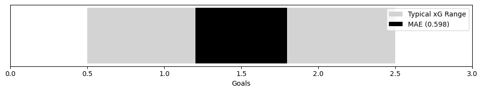
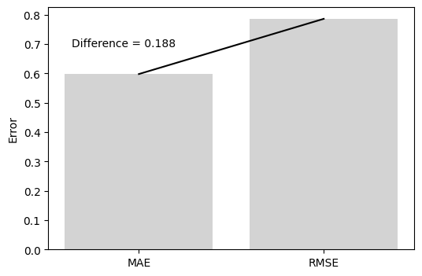
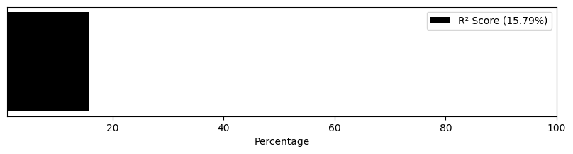
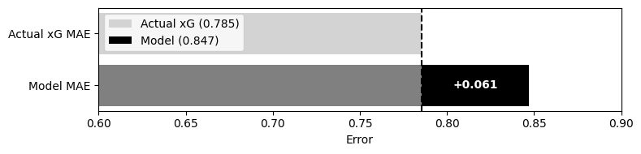
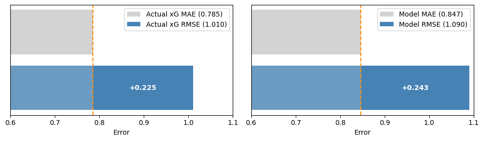

# ⚽ Soccer Prediction Model

The primary incentive behind this project was financial. I wanted an edge in sports trading. A repeatable, quantifiable advantage over the market.

That edge would not come from intuition and watching games. It would come from an algorithmic model that estimates the true probability of a match outcome, independent of bookmaker pricing.

So I built one.

This repository outlines the current architecture with explicit examples accompanying each component, and how the model performed to the single goal of finding value where the market is wrong.

To read more about how the algortihmic model was built and few examples, go [here](General%20Theory.md).

Now, for the results, I focused on;

- **Expected Goals (xG):**  The model’s primary function is to predict Expected Goals (xG); by comparing its forecast to the actual xG generated in a match, we can validate the accuracy of its foundational building blocks.
- **Probability:** Monte Carlo simulations translate xG into match odds, revealing where the market's pricing diverges from the model's calculated reality.
- **Profitability:** Profitability is the ultimate filter; backtesting against market odds determines whether the edge identified in the probabilities translates into actual returns.

## Expected Goals (xG)

Before diving into the results, here's a quick look at the three metrics I used to evaluate the model's performance;

- **MAE (Mean Absolute Error)**: This tells you the average size of the prediction errors. If the model predicts a team will generate 2.0 expected goals and they actually produce 1.5, that's an error of 0.5. The MAE simply averages all these individual errors across every prediction. Because it's measured in goals, it's fairly intuitive, lower numbers mean better predictions.
- **RMSE (Root Mean Square Error)**: This works similarly to MAE but places extra weight on larger mistakes. By squaring the errors before averaging them, any particularly bad predictions stand out. When RMSE runs noticeably higher than MAE, it suggests the model occasionally produces some really bad predictions that pull down the overall performance.
- **R² Score**: This measures how much of the real-world variation the model actually captures. A score of 1 would mean perfect predictions. A score of 0 means the model adds nothing, you'd be just as well off guessing the average every time. Any positive number indicates the model has identified some genuine patterns that help explain what's happening on the pitch.

### Performance Against Expected Goals

To give you some context, a team's expected goals in a single match usually falls somewhere between 0.5 and 2.5. That's the range we're working with. The model posted an MAE of 0.598. In plain terms, when the model projects a team's xG for a match, it's typically off by about six-tenths of a goal. Given the range we're dealing with, that's a reasonable margin.

The RMSE came in at 0.786. What matters most here is the relationship between the two error measures. The gap of 0.188 between RMSE and MAE tells me the model isn't producing those disastrous predictions I mentioned earlier. No single match is throwing everything off, the errors are fairly consistent across the board.

The R² score of 0.158 means the model explains roughly 16% of the variance in actual xG. Not overwhelming, but a clear signal that it has picked up on something real.

### Performance Against Actual Goals

This is the ultimate test. The performance here has inevitably weaker results, as we move from predicting a relatively stable metric (xG) to predicting discrete, low-probability events heavily influenced by finishing ability, goalkeeping, and simply plain luck. By comparing the model's performance against actual goals with how well the post-match xG metric performs at the same task, we can get a clearer picture of both the model's capabilities and football's inherent unpredictability.

Against actual goals, the model records a Mean Absolute Error of 0.847. For comparison, the actual post-match xG achieves an MAE of 0.785 when predicting the same goal outcomes. The gap between them is just 0.061 goals. To put that in perspective, the model misses the actual scoreline by roughly one additional goal every sixteen matches compared to the industry standard metric. Given that the model makes its predictions before a ball is kicked, while actual xG is calculated after the fact using detailed shot data, landing this close to the benchmark is a genuinely encouraging result.

The RMSE tells a similar story. For actual xG, the RMSE against goals sits at 1.010, with the gap between RMSE and MAE reaching 0.225. This spread reflects that even the post-match metric produces occasional larger errors. For the model, the RMSE of 1.090 against goals, alongside its MAE, yields a gap of 0.243. The difference between these two spreads is a modest 0.018. In other words, the model generates larger errors at almost exactly the same rate as the benchmark. When it misses by a wider margin, it's doing so in precisely the situations where randomness dominates, matches where clear chances go unconverted or speculative shots somehow find the net.

The R² score offers the most revealing comparison. Actual xG, despite being derived from the actual shots taken in a match, explains only 20.3% of the variance in goal scoring. This figure isn't a limitation of the metric; it's the mathematical expression of football's fundamental randomness. Against this ceiling, the model explains 7.2% of goal variance, capturing approximately one-third of the predictive power of the actual xG metric. In a sport where even the best possible measure of chance quality leaves 80% of outcomes unexplained, explaining any meaningful portion of the variance confirms that the model has successfully identified genuine relationships between match dynamics and actual scoring.

## Probability

**LOG LOSS (Cross-Entropy)**

- Measures accuracy of probability predictions
- Range: 0 (perfect) to infinity
- Good football models: 0.85-1.05
- Excellent models: <0.85
- Penalizes confident wrong predictions heavily

**RANKED PROBABILITY SCORE (RPS)**

- Accounts for ordinal nature of outcomes (Home > Draw > Away)
- Range: 0 (perfect) to 1 (worst)
- Good football models: 0.15-0.25
- Excellent models: <0.15
- Lower is always better

**CALIBRATION**

- Perfect calibration: predicted probability = actual frequency
- ECE < 0.02: Excellent calibration
- ECE 0.02-0.05: Good calibration
- ECE > 0.05: Needs improvement
- Well-calibrated models make probability bets profitable

BRIER SCORE:

- Mean squared error of probabilities
- Range: 0 (perfect) to 1 (worst)
- Good football models: 0.15-0.25
- Lower is better

KEY INSIGHTS:

1. A model can have good log loss but poor calibration
2. RPS is better for football than accuracy alone
3. Calibration is crucial for making probability-based decisions

## Profitability

**ROI (Return on Investment)**

- Measures profitability of betting strategy
- Formula: (Total Profit / Total Stakes) * 100
- Example: 10% ROI means you make $10 for every $100 bet
- Higher is better, but must be consistent over time

KEY INSIGHTS:

1. Positive ROI is the ultimate goal
2. Must be sustained over long term to be meaningful
3. Even small positive ROI can be profitable with large stakes
