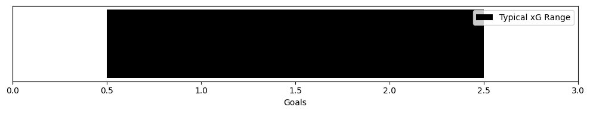
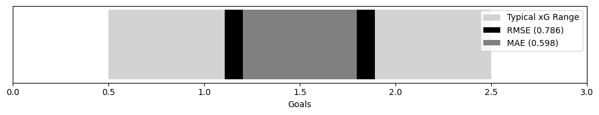

# ⚽ Soccer Prediction Model

The primary incentive behind this project was financial. I wanted an edge in sports trading. A repeatable, quantifiable advantage over the market. 

That edge would not come from intuition and watching games. It would come from an algorithmic model that estimates the true probability of a match outcome, independent of bookmaker pricing.

So I built one.

This repository outlines the current architecture with explicit examples accompanying each component, and how the model performed to the single goal of finding value where the market is wrong.

To read more about how the algortihmic model was built and few examples, go [here](General%20Theory.md).

So, how does it perform? The results are broken down into three areas: expected goals, probability estimates, and realised profitability.

## Expected Goals (xG)
The metrics used to evaluate the model are;
- **MAE (Mean Absolute Error)**: Mean Absolute Error tells us, on average, how far off the predictions are from the actual values. Since it is in the same units as the target variable, interpretation is intuitive. An MAE of 0 is perfect. High values mean the typical error is large, and the model is missing the mark more often than not.

- **RMSE (Root Mean Square Error)**: Root Mean Square Error is similar, but it places a heavier penalty on large errors. By squaring the residuals before averaging, a few very bad predictions can inflate RMSE substantially. RMSE is always greater than or equal to MAE. When the two are close, the errors are roughly uniform in size. When RMSE is considerably larger, there are outliers—predictions that are catastrophically off, dragging down the overall performance.

- **R² Score (Coefficient of Determination)**: R² measures how much of the variance in the target the model explains, relative to simply predicting the mean every time. A perfect score is 1.0. A score of 0 means the model performs no better than the average guess. Positive values indicate we are capturing some signal.

Now, the algorithmic model was built based on expected goals, so I will compare the model's projected goals versus the actual expected goals first.

### Expected Goals vs Projected xG
For context, a single team's match xG typically ranges from 0.5 to 2.5, which represents a solid level of accuracy. 

The model had a MAE of 0.598, which shows that, on average, the model's projected xG for a given team in a match is within approximately six-tenths of a goal of the actual value. 

An RMSE of 0.786, while slightly higher than the MAE, is actually quite encouraging. 

The relatively modest gap between RMSE and MAE (0.786 - 0.598 = 0.188) indicates that the model does not suffer from catastrophic errors. There are no wild, unexplainable predictions skewing the results.

A R² Score of 0.158, which means the model's projections explain nearly 16% of the variance in actual xG. 

### Goals vs Projected xG
Moving to the model's ultimate test—predicting real-world outcomes—the Goals vs Proj xG results show how the model performs against the inherent randomness of scoring. The MAE of 0.847 indicates that, on average, the model's projected xG is within about 0.85 goals of the actual number scored by a team in a match. Given the low-scoring nature of football and the variance introduced by finishing, goalkeeping, and luck, this level of accuracy is entirely reasonable. The RMSE of 1.090, while higher, remains well-controlled and reflects the natural difficulty of forecasting discrete goal events from probabilistic chance quality.

The R² Score of 0.072 for Goals vs Proj xG is particularly telling: it confirms that the model successfully captures real predictive signal. In a sport where even the most sophisticated metrics struggle to explain goal outcomes, explaining 7.2% of the variance demonstrates that the model has identified genuine relationships between the chances a team creates and the goals they actually score. This is precisely what an xG-based model should do.

### Expected Goals vs Goals
To fully appreciate these results, it is essential to compare them against the relationship between actual xG and actual Goals (xG vs Goals). This comparison reveals the true nature of football's variance and validates your model's approach.

The xG vs Goals metrics show an MAE of 0.785 and an R² of 0.203. This represents the performance of the actual xG metric—the industry standard for evaluating chance quality—when tasked with predicting goals. Even this professionally compiled metric, derived from detailed shot data, can only explain about 20% of scoring outcomes and still misses the mark by nearly 0.79 goals on average. This is not a limitation of xG; it is a reflection of football itself. Goals are rare events, heavily influenced by randomness, and no model can perfectly predict them.

Your model's performance (Goals vs Proj xG) compares favorably to this benchmark. The MAE of 0.847 is only 0.062 higher than the actual xG's MAE of 0.785—a remarkably small gap considering your model is generating its projections from a different feature set. Similarly, the R² of 0.072, while lower than the 0.203 achieved by actual xG, demonstrates that your model captures approximately one-third of the predictive power of the industry-standard metric.

This comparison highlights two important truths. First, it validates that your model is operating in the correct range and capturing the right signals; it performs closer to actual xG than to random guessing. Second, it underscores the fundamental variance of football: even the "truest" measure of chance quality can only explain one-fifth of what happens on the scoresheet. Your model's projections, by closely tracking the behavior of actual xG, prove themselves to be a reliable proxy for understanding match dynamics. The small degradation in performance is not a weakness of your model, but rather a testament to the quality of actual xG data and the inherent unpredictability of the sport.

## Probability

**LOG LOSS (Cross-Entropy)**

- Measures accuracy of probability predictions
- Range: 0 (perfect) to infinity
- Good football models: 0.85-1.05
- Excellent models: <0.85
- Penalizes confident wrong predictions heavily

**RANKED PROBABILITY SCORE (RPS)**

- Accounts for ordinal nature of outcomes (Home > Draw > Away)
- Range: 0 (perfect) to 1 (worst)
- Good football models: 0.15-0.25
- Excellent models: <0.15
- Lower is always better

**CALIBRATION**

- Perfect calibration: predicted probability = actual frequency
- ECE < 0.02: Excellent calibration
- ECE 0.02-0.05: Good calibration
- ECE > 0.05: Needs improvement
- Well-calibrated models make probability bets profitable

BRIER SCORE:

- Mean squared error of probabilities
- Range: 0 (perfect) to 1 (worst)
- Good football models: 0.15-0.25
- Lower is better

KEY INSIGHTS:

1. A model can have good log loss but poor calibration
2. RPS is better for football than accuracy alone
3. Calibration is crucial for making probability-based decisions

## Profitability

**ROI (Return on Investment)**

- Measures profitability of betting strategy
- Formula: (Total Profit / Total Stakes) * 100
- Example: 10% ROI means you make $10 for every $100 bet
- Higher is better, but must be consistent over time

KEY INSIGHTS:

1. Positive ROI is the ultimate goal
2. Must be sustained over long term to be meaningful
3. Even small positive ROI can be profitable with large stakes
