# ⚽ Soccer Prediction Model

The primary incentive behind this project was financial. I wanted an edge in sports trading. A repeatable, quantifiable advantage over the market.

That edge would not come from intuition and watching games. It would come from an algorithmic model that estimates the true probability of a match outcome, independent of bookmaker pricing.

So I built one.

This repository outlines the current architecture with explicit examples accompanying each component, and how the model performed to the single goal of finding value where the market is wrong.

To read more about how the algortihmic model was built and few examples, go [here](General%20Theory.md).

Now, for the results, I focused on;

- **Expected Goals (xG):**  The model’s primary function is to predict Expected Goals (xG); by comparing its forecast to the actual xG generated in a match, we can validate the accuracy of its foundational building blocks.
- **Probability:** Monte Carlo simulations translate xG into match odds, revealing where the market's pricing diverges from the model's calculated reality.
- **Profitability:** Profitability is the ultimate filter; backtesting against market odds determines whether the edge identified in the probabilities translates into actual returns.

## Expected Goals (xG)

Before diving into the results, here's a quick look at the three metrics I used to evaluate the model's performance;

- **MAE (Mean Absolute Error)**: This tells you the average size of the prediction errors. If the model predicts a team will generate 2.0 expected goals and they actually produce 1.5, that's an error of 0.5. The MAE simply averages all these individual errors across every prediction. Because it's measured in goals, it's fairly intuitive, lower numbers mean better predictions.
- **RMSE (Root Mean Square Error)**: This works similarly to MAE but places extra weight on larger mistakes. By squaring the errors before averaging them, any particularly bad predictions stand out. When RMSE runs noticeably higher than MAE, it suggests the model occasionally produces some really bad predictions that pull down the overall performance.
- **R² Score**: This measures how much of the real-world variation the model actually captures. A score of 1 would mean perfect predictions. A score of 0 means the model adds nothing, you'd be just as well off guessing the average every time. Any positive number indicates the model has identified some genuine patterns that help explain what's happening on the pitch.

### Performance Against Expected Goals

To give you some context, a team's expected goals in a single match usually falls somewhere between **0.5** and **2.5**. That's the range we're working with. The model posted an MAE of **0.598**. In plain terms, when the model projects a team's xG for a match, it's typically off by about six-tenths of a goal. Given the range we're dealing with, that's a reasonable margin.

The RMSE came in at **0.786**. What matters most here is the relationship between the two error measures. The gap of **0.188** between RMSE and MAE tells me the model isn't producing those disastrous predictions I mentioned earlier. No single match is throwing everything off, the errors are fairly consistent across the board.

The R² score of **0.158** means the model explains roughly **16%** of the variance in actual xG. Not overwhelming, but a clear signal that it has picked up on something real.

### Performance Against Actual Goals

This is the ultimate test. The performance here has inevitably weaker results, as we move from predicting a relatively stable metric (xG) to predicting discrete, low-probability events heavily influenced by finishing ability, goalkeeping, and simply plain luck. By comparing the model's performance against actual goals with how well the post-match xG metric performs at the same task, we can get a clearer picture of both the model's capabilities and football's inherent unpredictability.

Against actual goals, the model records a Mean Absolute Error of **0.847**. For comparison, the actual post-match xG achieves an MAE of **0.785** when predicting the same goal outcomes. The gap between them is just **0.061** goals. To put that in perspective, the model misses the actual scoreline by roughly one additional goal every sixteen matches compared to the industry standard metric. Given that the model makes its predictions before a ball is kicked, while actual xG is calculated after the fact using detailed shot data, landing this close to the benchmark is a genuinely encouraging result.

The RMSE tells a similar story. For actual xG, the RMSE against goals sits at **1.010**, with the gap between RMSE and MAE reaching **0.225**. This spread reflects that even the post-match metric produces occasional larger errors. For the model, the RMSE of 1.090 against goals, alongside its MAE, yields a gap of **0.243**. The difference between these two spreads is a modest **0.018**. In other words, the model generates larger errors at almost exactly the same rate as the benchmark. When it misses by a wider margin, it's doing so in precisely the situations where randomness dominates, matches where clear chances go unconverted or speculative shots somehow find the net.

The R² score offers the most revealing comparison. Actual xG, despite being derived from the actual shots taken in a match, explains only **20.3%** of the variance in goal scoring. This figure isn't a limitation of the metric; it's the mathematical expression of football's fundamental randomness. Against this ceiling, the model explains **7.2%** of goal variance, capturing approximately one-third of the predictive power of the actual xG metric. In a sport where even the best possible measure of chance quality leaves 80% of outcomes unexplained, explaining any meaningful portion of the variance confirms that the model has successfully identified genuine relationships between match dynamics and actual scoring.

## Probability

With the model's core xG predictions validated, the next section is about how well do those predictions translate into match probabilities. After all, the financial edge I'm seeking doesn't come from accurately forecasting expected goals, it comes from identifying when the market's odds diverge from the true likelihood of an outcome. That requires probabilities that are not only accurate in isolation but also well-calibrated enough to act upon when compared against bookmaker pricing.

For this reason, I'm focusing on two specific markets where the model can be tested against real-world odds: the **1X2 market** (home win, draw, away win) and the  **Over/Under 2.5 goals market** . These represent the most liquid and widely available betting markets, making them the natural candidates for a value-based trading strategy.

Before diving into the results, here's a quick look at the metrics I used to evaluate the model's probability predictions;

* **Log Loss (Cross-Entropy):** This measures the accuracy of probability predictions by penalizing confident wrong predictions heavily. Think of this as a penalty system for probability predictions. If you predict an event will happen with 90% confidence and it happens, you get a small penalty. If you predict 90% confidence and it *doesn't* happen, you get a massive penalty. The scale starts at 0 (perfect) and goes up from there. To make sense of the number:
  * **For binary classification** (two choices): a naive model that always predicts 50% for everything would score around 0.693. The further below 0.693, the better the model is at making confident, accurate predictions.
  * **For three-class problems**: a naive model that always predicts 33% probability for each class (since there are three equally likely options) would score around 1.099. If the model scores near 1.099, it's essentially guessing randomly. The further below this number, the more confidently and accurately the model is identifying the correct class out of the three possibilities.
* **Ranked Probability Score (RPS):** This accounts for the natural order of football outcomes (Home > Draw > Away). It measures how close your predicted probabilities are to the actual results, but in a cumulative way, for example, predicting a draw when the actual result is a home win is considered a smaller mistake than predicting an away win, because the ranks are closer. A score of 0 is perfect, 1 is the worst. For context, a naive model that simply guesses 33% for each outcome would score around 0.22.
* **Brier Score**: This measures the accuracy of the predicted probabilities for binary outcomes (like Over 2.5 goals). If you predict something with high confidence and you’re right, that’s a small error. If you predict something with high confidence and you’re wrong, that’s a large error. Again, a score of 0 is perfect, 1 is the worst. A naive model that always predicts 50% for Over would score 0.25, anything below that indicates the model is better than random guessing.
* **Calibration:** This answers the essential question: when the model says an event has a 40% chance of happening, does it actually occur about 40% of the time? The Expected Calibration Error (ECE) measures the average gap between predicted probabilities and actual frequencies. An ECE of 0.03 means that, on average, when the model predicts a certain probability, the actual outcome frequency is within 3 percentage points of that prediction. So if it predicts 40%, you can expect the true rate to be somewhere between 37-43%. For probability-based betting decisions, good calibration is essential—it ensures that any apparent edge against market odds is grounded in reality.

### Performance Against Market Odds

#### 1X2 Market Performance

In the three-outcome match result market, the model posts a log loss of **1.0587**. While the market´s log loss is **1.0342**. Both the model and the market sit below the naive baseline of approximately 1.099, which tells us that both predictions are, on average, more accurate than random chance. The market's score is lower than the model's, and here's why: log loss rewards confident correct predictions. The 1X2 market is dominated by bets on favorites, people put their money on the team expected to win. When those favorites actually win, which they do more often than not, the market's confident predictions are rewarded with a lower log loss. The market is essentially being penalized less because it's confidently backing the outcomes that happen most frequently.

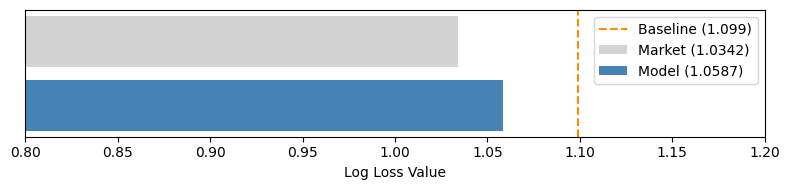

The model's Ranked Probability Score is  **0.2148**. Remember that a naive 33% guess would score around 0.22. The model comes in slightly below that, meaning it's making reasonably ordered predictions. It generally knows that when it assigns higher probability to a home win, home wins tend to happen more often, and it respects the natural ordering of outcomes. The market's RPS of **0.2079** is again lower, following the same pattern: the market's confidence on favorites gives it a small edge in this metric as well.

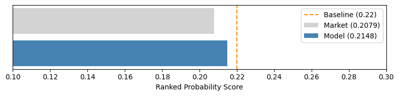

Now, the calibration story. The model's Expected Calibration Error for 1X2 is **0.0292.** This means that when you look across all matches where the model predicted, say, a 40% chance of a home win, the actual frequency of home wins in those matches lands within about **2.92%** of that 40% figure. The model's probability scale is trustworthy, a 60% chance really means something much closer to a 60% long-run frequency than a 50% or 70% frequency.

The market's ECE is **0.0391**. This is higher. This difference matters because log loss and RPS measure something slightly different from calibration. Log loss cares about both the ranking of predictions and the sharpness of confidence. It rewards you for being confidently correct. The market gets that reward regularly by backing favorites. But calibration asks a different question: when you say something has X% probability, does it actually happen X% of the time? Here, the model outperforms the market. Its probabilities are more reliable as statements of true likelihood, even if the market edges it out on picking the exact winner in individual matches.

For a value-based trading strategy, this combination is actually ideal. The model's probabilities are trustworthy, when it identifies a divergence from market odds, that divergence rests on probability estimates that have proven themselves accurate across hundreds of matches. The market may be slightly sharper at calling the winner, but the model is better at telling you what the true odds really are.

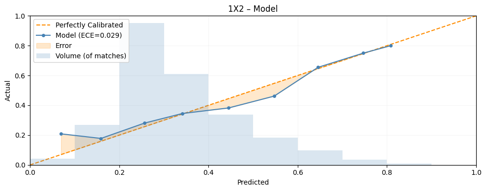

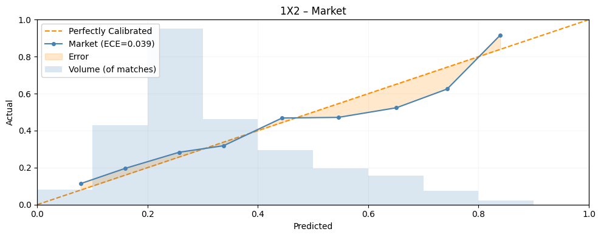

#### Over/Under 2.5 Goals Performance

In the binary Over/Under market, the model's log loss is **0.6789**. The naive baseline here, always predicting 50%, is 0.693. The model comes in below that, meaning it's making genuinely informative predictions about whether matches will exceed 2.5 goals. The market's log loss is **0.6820**, which is also below the baseline but slightly higher than the model's. Here, the model actually has the edge in log loss, meaning its confident predictions are slightly more accurate on average.

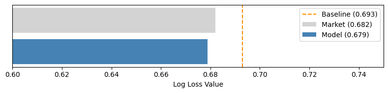

The Brier Score tells a similar story. The model scores  **0.2424** , below the 0.25 naive benchmark. The market scores **0.2442**. Both are slighlty better than random guessing.

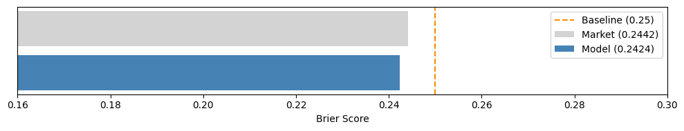

For calibration in this market, the model's ECE is **0.0349** and the market's is **0.0392**. The pattern holds: the model's probability estimates align more closely with actual outcome frequencies. When the model says there's a 70% chance of Over 2.5 goals, that event occurs at a rate closer to 70% than the market's equivalent predictions do.

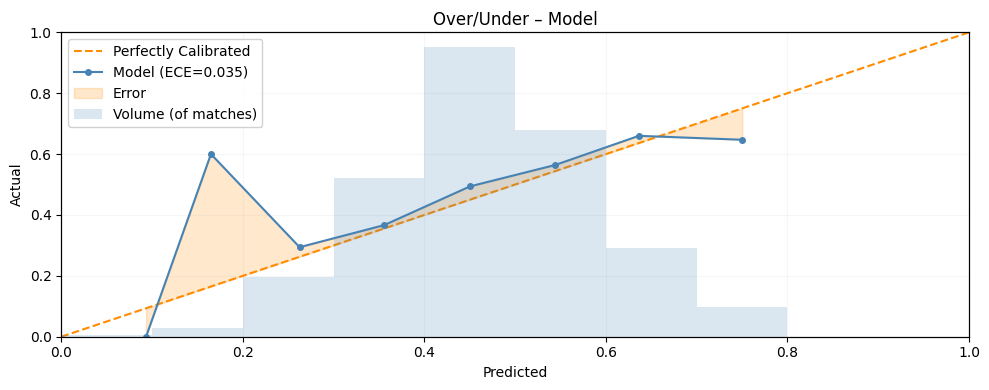

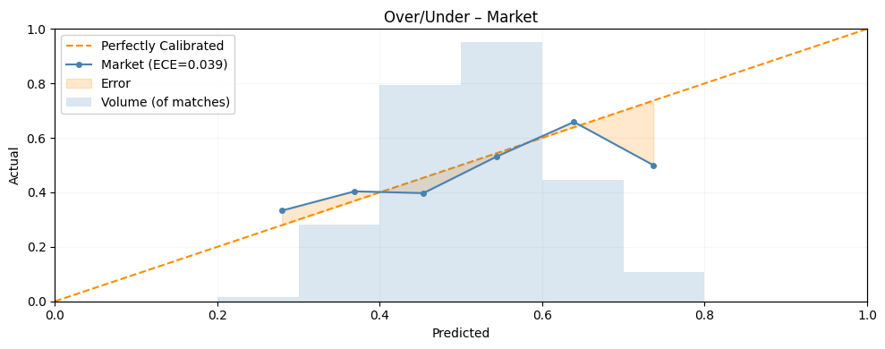

## Profitability

The transition from *accurate probabilities* to *profitable trading* represents the final and most unforgiving test. A model can demonstrate statistical validity across hundreds of matches, but all of that becomes irrelevant if those advantages cannot survive the friction of real-world betting markets, for example, the bookmaker's margin, the liquidity of the market, the bankroll management, etc.

To test the model's financial viability, I ran a full backtest starting with a **$10k** over about **6 months** and more than **5k bets**. To ensure this simulated growth reflected real-world constraints, two critical rules were enforced:

* **Liquidity Cap:** Even if the bankroll grew, I capped the money used for calculating bet sizes at $10K. In real life, you can't place huge bets without moving the odds against you.
* **Delayed P&L Realization:** Money from a bet was only available *after* the match ended. No instant reinvestment. Funds in play are tied up.

For stake sizing, I used the **Kelly Criterion** (a formula that tells you how much to bet based on your edge) with a fractional approach to manage risk. A confidence multiplier adjusted stakes upward when the model had better data on a match.

### The Growth Curve

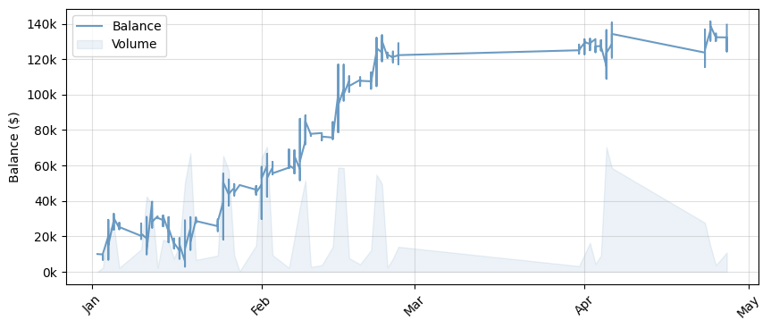

The bankroll started at **$10K** and ended at  **$139K** , with total profit of **$129K** and growth of **1,294%** . But the path had three distinct phases.

1. **The spike:** The model jumped from $10K to **$40K** fast. A handful of high-value bets hit in a short window. Early success, but it set the stage for what came next.
2. **The 92% drawdown:** From that $40K peak, the bankroll crashed to about  **$3K** . A *drawdown* means peak-to-trough drop. This one went below starting capital. If you were trading real money, this would be gut-check time. The strategy survived because fractional Kelly kept stakes small enough that a losing streak didn't wipe the account completely.
3. **The grind:** After the low point, the bankroll settled into steady, consistent growth. No more spikes. Just disciplined upward movement.

### Key Performance Metrics

Across more than 5,000 bets, the total amount wagered was approximately **$1.47M**, generating  **$129K in profit**, which equates to an  **8.76% ROI**, meaning the model made about **$9 in profit for every $100 wagered**.

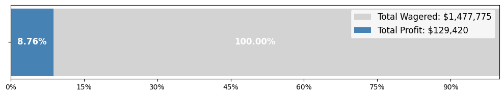

The win rate was **31.86%**, with average odds of **10.78**. At those odds, the break-even win rate is **9.27%** (calculated as 1 divided by the odds). Winning 31% of the time at these prices means each winning bet pays for multiple losses and still leaves profit. The profit factor, which compares gross winnings to gross losses, came in at  **1.18**. For every dollar lost on losing bets, the model made back that dollar plus 18 cents.

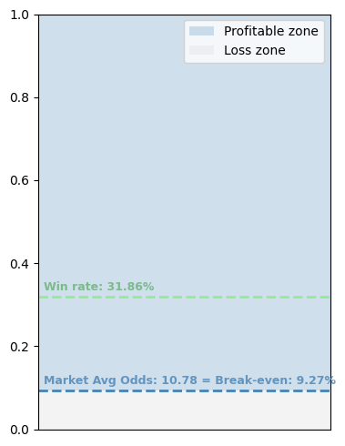

### Simulation Analysis

To test whether these results could be explained by luck, I ran **10k simulations** where the same bets were decided randomly based on the market's implied probabilities. If the model had no real edge, its results would sit somewhere in the middle of the simulation cloud.

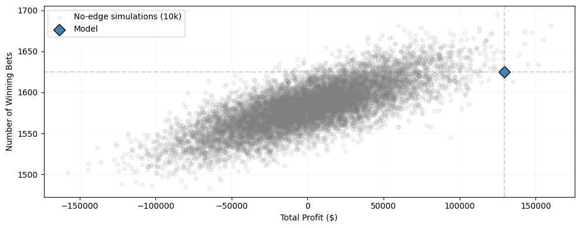

The gray dots represent the 10k simulations. Most cluster around lower profit and fewer wins. The blue diamond is the actual model performance, positioned far to the right on total profit and slightly elevated on wins.

The numbers confirm what the chart shows. The **Sharpe ratio per bet** was **0.05**, which is modest for individual bets. But aggregated across thousands of bets, the **portfolio Sharpe ratio** reached **3.48**. For context, a Sharpe ratio above 1 is good, above 2 is excellent, and above 3 is exceptional in traditional finance. The **p-value** of **0.0013** means that if the model had no true edge, we would expect results this good by chance only 13 times out of 10,000 attempts.

### Expected Value vs. Realized Profit

If the model's probability estimates are accurate, higher expected value before matches should translate into higher profits over time.

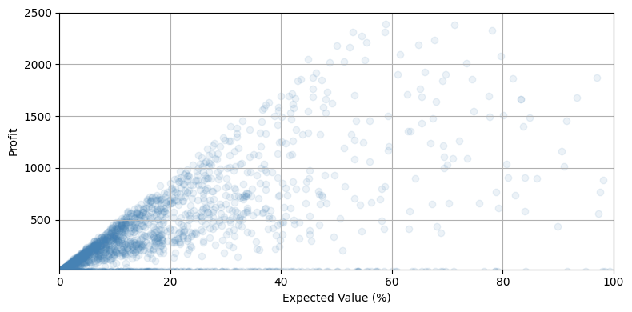

The scatter plot shows this relationship. Most bets cluster in the **15% to 17% expected value** range, with typical winning profits aroun **$250**. As expected value increases, the potential profit range widens, but the central tendency shifts upward. Bets with higher expected value produced larger profits when they won. There is no pattern of high-EV bets systematically underperforming.

### Performance by Market Type

Different betting markets produced different results. Here is the breakdown:

|     Market     | Bets  | Win Rate | Avg Odds | Profit   |
| :------------: | ----- | :------: | -------- | -------- |
|      1X2      | 648   |  28.4%  | 4.71     | +$19,786 |
| Asian Handicap | 1,798 |  40.7%  | 3.33     | +$68,291 |
| Correct Score | 1,477 |   6.3%   | 29.08    | -$6,110  |
| Over/Under 2.5 | 1,178 |  52.3%  | 2.57     | +$47,453 |

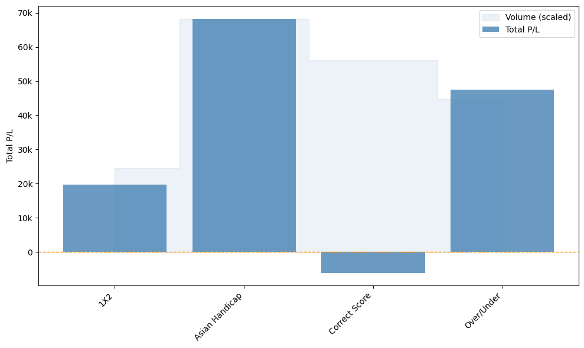

The bar chart shows profit by market with volume overlaid. Asian Handicap and Over/Under delivered over **$115K** in combined profit. 1X2 provided solid support. Correct Score had high volume but negative profit, indicating either that the edge was too small or the probability estimates were slightly optimistic in this market.
