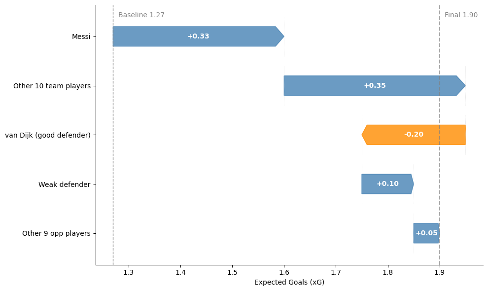
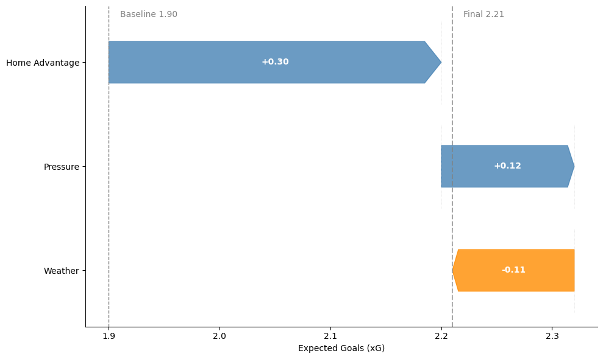
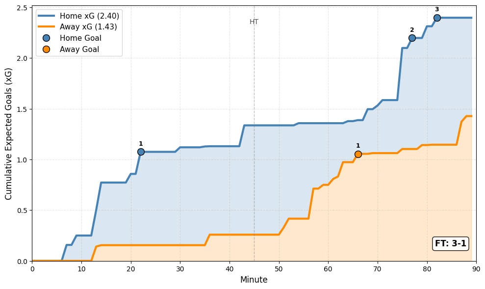

# The Anatomy of a Prediction

The model I built is not a single algorithm, but an end-to-end pipeline designed to transform raw, chaotic football data into a calibrated, actionable probability. The core philosophy is that a prediction is only as good as its foundation. That foundation is built in three distinct phases:  **Data Gathering**,  **Data Processing & Modeling**, and **Simulation & Output**.

I will walk you through each phase, explaining the *what* and the *why* at every step. However, the specific *how*, the proprietary code and algorithms that give me my edge, will remain confidential, but the architectural principles are laid bare to demonstrate the rigor and sophistication of the approach.

The central idea is that predicting soccer matches requires understanding:

## Data Gathering

Before any modeling can happen, I need the raw materials. For a player-centric model, this means collecting an enormous amount of granular, match-level data. This is the most tedious, unglamorous, yet absolutely critical part of the entire process. Garbage in, garbage out.

My primary data source is **[FBRef.com](https://fbref.com/)**, an invaluable resource for comprehensive football statistics. The process is not a simple one-click download. It's a deliberate, multi-layered operation designed to build a complete picture of every match and every team. The process follows three distinct steps: gathering team infrastructure, scraping match evolution, and then the crucial work of cleaning and validation.

### Step 1: Infrastructure Data

Before a single ball is kicked, I need to understand the semi-permanent characteristics of the teams and competitions I'm modeling. This forms the contextual backbone for every match. For each league I target (e.g., Premier League, La Liga, Bundesliga), my scrapers first gather foundational data on every team:

* **Geolocation:** For every team, I capture its **GPS coordinates**. This allows me to calculate precise travel distances between any two stadiums for upcoming matches.
* **Elevation:** I also record the team's  **elevation above sea level**. This is a subtle but potentially impactful variable. Teams accustomed to sea level can struggle with thinner air at high-altitude venues like La Paz or even some stadiums in Mexico and Spain. This data feeds directly into the *contextual adjustment* layer of the model.
* **Season Schedule:** Finally, I scrape the master schedule for each league. This provides the framework: knowing which teams play each other, on what date, and at whose home ground. This schedule is the roadmap that my match-level scrapers will follow.

### Step 2: Event Data

With the schedule as my guide, I programmatically navigate to the individual page for *every single match* in my dataset. This is the core data-gathering operation, and it's designed to capture the complete, dynamic story of the game. For each match, I scrape the following:

* **Match Essentials:** The date, the competition, the final score, and which team is designated as the home side. This seems basic, but it's the foundational record.
* **Player Participation & Lineups:** I capture the **starting eleven** for both teams, as well as every **substitute** who entered the pitch and the minute they did so. This is non-negotiable.
* **The Flow of the Game (Event Log):** This is where the data becomes truly rich. I scrape a minute-by-minute log of key events:
  * **Goals:** Who scored, who assisted (if recorded), and the minute of the goal.
  * **Shot Data:** Every shot, including its minute, the player responsible, and whether it was on target, off target, or blocked. This is the foundation for building player offensive coefficients.
  * **Disciplinary Actions:** Every yellow card and, most importantly, **red card** . The minute of a red card is crucial, as it dictates how many minutes a team will be playing with a numerical disadvantage.
* **Contextual Match Factors:**
  * **Weather Data:** For each match, I attempt to source weather conditions at the time of the game (e.g., temperature, humidity, precipitation). Inclement weather can be a significant equalizer or disrupter.
  * **Officiating Crew (if available):** Some referees have statistically significant tendencies (e.g., showing more cards, allowing more physical play). This is a more advanced data point I aim to capture.

### Step 3: Cleaning, Linking, and Validation

Raw data, especially when scraped from the web, is messy. The most time-consuming and intellectually demanding part of data gathering is transforming this raw clutter into a clean, reliable, and interconnected database. This step has several critical sub-processes:

* **Player Name Disambiguation & Unification:** This is the single biggest challenge. A player like "Bernardo Silva" might be listed as "Bernardo Mota Veiga de Carvalho e Silva" on a more formal page. To solve this, I've built a robust pipeline that:
  1. **Normalizes Names:** Strips out accents, standardizes common short forms (e.g., "Bob" -> "Robert"), and creates multiple name variations to search against.
  2. **Generates Persistent Player IDs:** The most critical step. Every player is assigned a unique, persistent identifier the first time they appear in my dataset. From that point on, every performance by "Neymar" (regardless of how his name is spelled on a given match page) is linked to that single ID. This creates a unified, lifelong performance record for every player, allowing me to track their development, consistency, and form over multiple seasons and across different leagues.
* **Data Validation & Sanity Checks:** An automated system runs after every data import to ensure quality. It performs checks like:
  * **Minute Aggregation:** Does the sum of minutes played for all players on a team roughly equal 90–95 minutes (accounting for stoppage time)? If it's significantly off, it indicates a missing player or an error in substitution data.
  * **Scoreline Consistency:** Do the number of goalscorers scraped from the event log sum to the final scoreline scraped from the match header?
  * **Duplicate Detection:** Does the same player appear twice in the same starting eleven? This flags potential name-cleaning failures.
* **Linking Datasets:** The final step is to connect everything. The match event log is linked to the persistent player IDs. The match location is linked back to the team's stadium data to calculate travel distance. The match date is used to calculate rest days since the team's last game. This creates a single, rich, and relational database where every piece of information is connected and contextualized.

This meticulous, three-step process results in a clean, structured, and historical database where every player action is tied to a specific match, a specific context, and a unique player profile. It is the essential foundation upon which the entire predictive model is built.

## Data Processing & Modeling

With a clean, robust dataset in place, the real work begins. This phase is where the raw data is transformed into the predictive intelligence of the model. It's a two-stage process: first, establishing a baseline team strength from individual players, and second, adjusting that baseline for the unique context of the upcoming match.

#### Stage 1: Quantifying Individual Player Impact

A team is not a monolithic entity; it's a collection of individuals. A model that treats "Liverpool" as a single, static value will fail to account for the massive drop-off when, say, their star defender is replaced by a squad player. My model solves this by building a profile for every player.

* **Offensive and Defensive Coefficients:** Using a purpose-built machine learning model, I analyze every player's historical performance data. The model's goal is to estimate two separate, latent values for each player: an **Offensive Coefficient** and a  **Defensive Coefficient** .
  * The **Offensive Coefficient** quantifies a player's contribution to their team's expected goal generation. For a forward, this might be heavily influenced by shots and expected assists. For a midfielder, it might be about progressive passes and chance creation.
  * The **Defensive Coefficient** quantifies a player's ability to suppress the opponent's expected goals. This draws from tackling data, interceptions, blocks, and pressure statistics.

The model learns these coefficients by analyzing countless matchups. It understands that when a player with a high offensive coefficient faces a defender with a low defensive coefficient, the attacking team's overall expected output should increase.

#### Stage 2: Contextual Adjustment

Now that we have a library of player coefficients, we can project the strength of any given lineup. Raw, aggregated team strength sums are a powerful baseline, but football is played in the real world, not a spreadsheet. This is where the second ML model, a gradient-boosting model (XGBoost), comes into play. This model takes the baseline projections and adjusts them based on a rich set of contextual features. It learns, for example, that a team's offensive output is typically suppressed when:

* They are playing away from home (**home advantage**).
* They have traveled a long distance or are playing at high **altitude** (**travel fatigue & environmental factors**).
* They have fewer rest days than their opponent (**player fatigue** ).
* They are playing with 10 men following a **red card**. The model doesn't just apply a flat penalty; the impact is weighted by the time remaining in the match.
* The current **scoreline** creates pressure. A team chasing a goal plays differently than a team protecting a lead.

This adjustment layer is crucial. It captures the non-linear effects of the game's many variables, refining the raw player-based projection into a much more accurate, context-aware prediction of expected goals for both sides.

## Simulation & Output

Having generated a robust, context-adjusted expected goals (xG) figure for both teams, we must simulate the randomness inherent in the sport. This is where **Monte Carlo simulation** becomes the star of the show.

* **The Simulation Engine:** I treat the projected xG not as a guaranteed number of goals, but as the **rate parameter for a goal-scoring process**. In each of the 10,000 simulations, the model "plays" the match. It uses the adjusted team strengths to determine the volume and quality of chances. A team with a higher projected xG will, on average, generate more high-quality shots in the simulation.
* **Modeling Game Dynamics:** The simulation isn't a simple "draw two final scores from a hat." It's a dynamic, minute-by-minute (or state-based) process, inspired by concepts like Markov chains. The model accounts for:
  * **Randomness of Scoring:** Even with a high xG, a team might fail to score in a given simulation, or a single low-xG chance might find the back of the net.
  * **Tactical Changes & Substitutions:** The model can incorporate the expected impact of key substitutes entering the game in the second half.
  * **Game-State Evolution:** The model recognizes that the game state changes. If a team falls behind by two goals, their effective "style" and subsequent xG generation will change. The model adjusts for this, simulating the push and pull of a real match.
* **Aggregating the Results:** After running 10,000 simulations, I have a massive log of final scorelines. The probability of a **home win** is simply the percentage of simulations that ended with the home team having more goals. The same is done for **away wins** and **draws** . From this distribution, I can also calculate the fair odds for any market (e.g., over/under 2.5 goals, both teams to score).

The final output is a set of probabilities that are the direct result of a complex chain: starting from individual player performances, aggregated into a team strength, adjusted for real-world context, and finally subjected to the beautiful randomness of a simulated match. This is my "fair line." When a bookmaker's odds deviate from this line, it represents a potential quantifiable edge, a discrepancy between the market's perception and the model's probabilistic reality.
